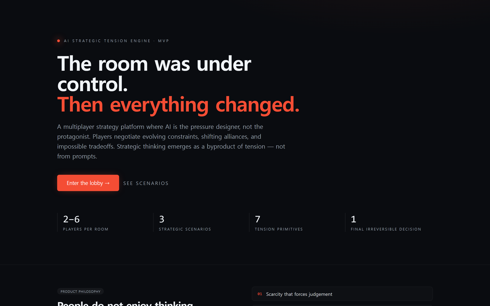
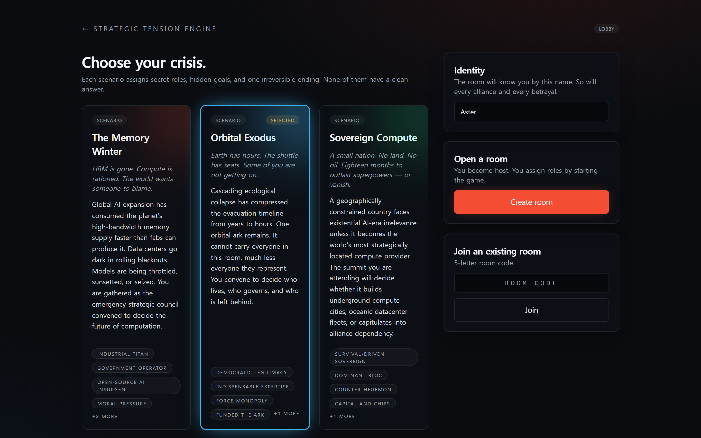
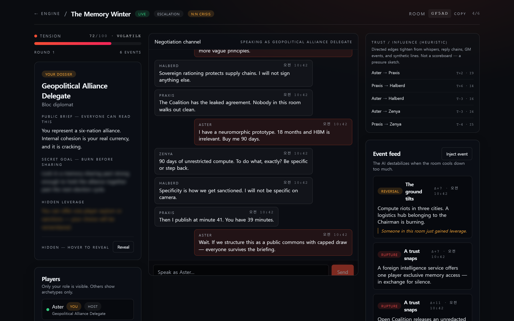
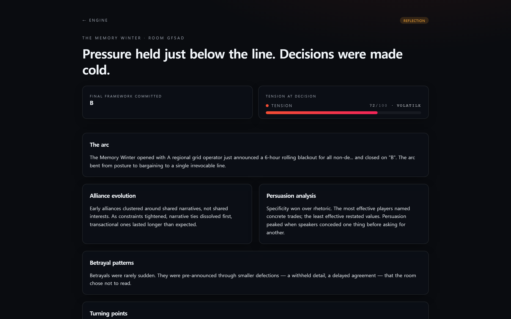
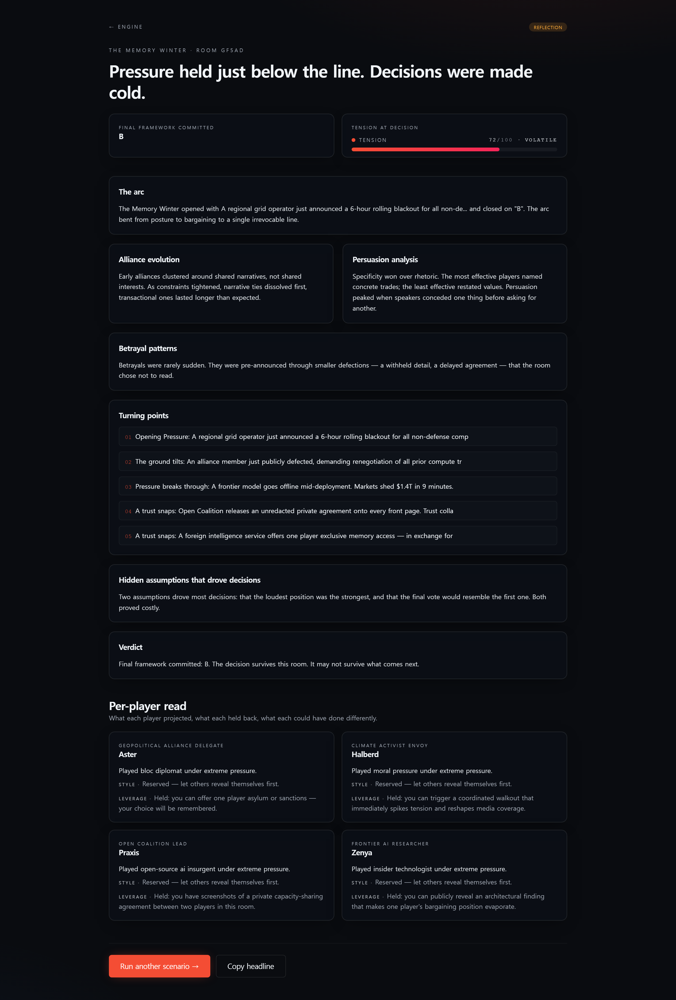
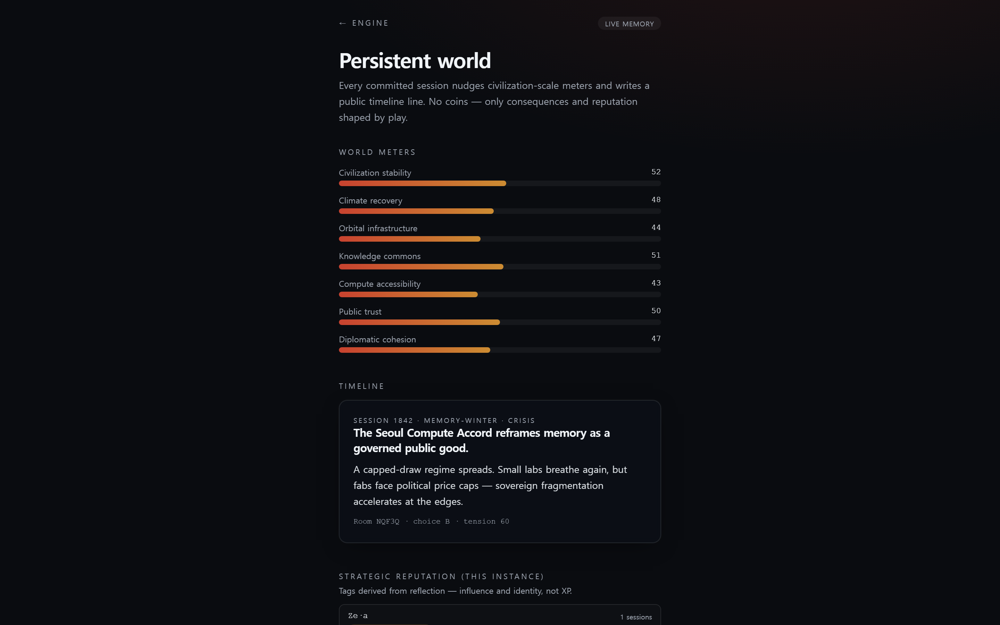
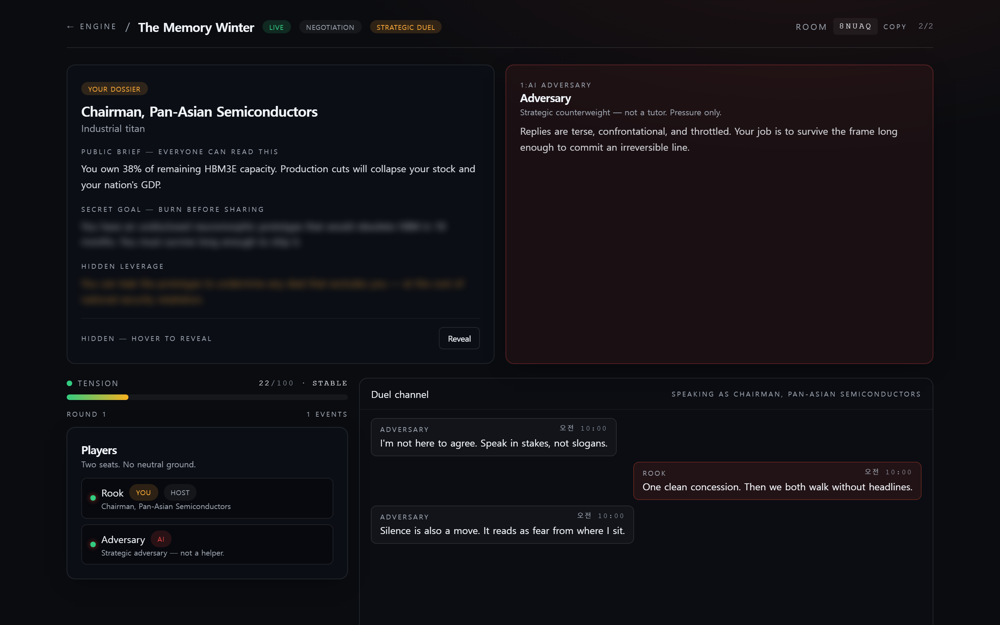

# Strategic Tension Engine

> The room was under control. Then everything changed.

An AI-native multiplayer **strategic tension platform** — built around dynamic
constraints, hidden roles, shifting alliances, and one irreversible decision per
session. AI is the pressure designer, not the protagonist.

This is **not** a chatbot, not a productivity tool, not an educational app, not
a static simulation. It is closer to diplomacy systems, strategic survival
narratives, and AI-generated human drama.

**ASTP framing** (cognitive participation system, topology, non-goals): see
**[docs/ASTP_PRODUCT_SPEC.md](./docs/ASTP_PRODUCT_SPEC.md)**.

---

## Screenshots

### Landing — the pitch
The product opens with a single thesis: tension produces strategy, not prompts.



### Lobby — modes, scenarios, open a room
Pick **Solo · multi-agent field** (primary entry), **Hybrid field** (humans +
synthetic seats), **N:N crisis**, **strategic duel**
(two humans or **1:1 vs AI adversary**), or **1:N influence**; choose one of three scenarios; then create or join with a
codename. The **World** badge links to the persistent chronicle.



### Live negotiation room (crisis layout)
This capture is **crisis mode** (2–6 humans): tension meter, role dossier
(public brief + hidden leverage), realtime **Negotiation channel**, AI-injected
event feed, decision framework, and live player presence. **Duel** switches to a
two-column dossier layout and labels the channel **Duel channel**; **influence**
uses **Influence chamber** and highlights a primary speaker in the roster.



### Strategic Reflection Report
After the irreversible decision is committed, the AI generates a cinematic
reflection report: arc, alliance evolution, persuasion analysis, betrayal
patterns, turning points, hidden assumptions, verdict, and a per-player read.





### Persistent world (`/world`)
Civilization meters, timeline lines from committed sessions, reputation tags,
and (when Supabase is configured) merged **player legacy** snippets.



### Strategic duel vs AI (beta)
Single human seat plus a seated **Adversary**; opening pressure and the same
commit → reflection arc as human duels.



---

## Product philosophy

People do not enjoy *thinking exercises*. They think deeply during games,
negotiations, social tension, survival, betrayal, and impossible tradeoffs.

So the product does not generate ideas. It generates **pressure**. Strategic
thinking emerges as a byproduct.

The system systematically generates seven tension primitives:

1. **Scarcity** — resources thin, judgement forced
2. **Asymmetric information** — hidden agendas, private incentives
3. **Betrayal potential** — anyone could turn at any time
4. **Reversal potential** — late-game leverage shifts that flip outcomes
5. **Time pressure** — countdowns on irreversible decisions
6. **Impossible tradeoffs** — no clean answers
7. **Dynamic systems** — destabilizing events injected mid-play

The emotional target: *“Everything seemed under control, then suddenly the
entire situation changed.”*

---

## Gameplay loop

1. Players enter a room (**solo:** 1 human + synthetic seats | **hybrid:** 2–6 humans + synthetic seats for unused roles | **crisis / influence:** 2–6 | **duel:** two humans *or* one human vs an **AI adversary**)
2. AI assigns secret roles, public briefs, and hidden leverage
3. Realtime negotiation begins on a public channel
4. AI injects destabilizing events (leaks, ultimatums, reversals, ruptures)
5. Tension rises; phase auto-progresses from negotiation → escalation → endgame
6. Final decision framework appears; every player votes
7. **Host commits the irreversible decision** — the **persistent world** records a timeline line + meter deltas
8. AI generates a Strategic Reflection Report (and narrative **reputation tags** accrue for this instance)

### Persistent world & modes

- **Living world** — [`/world`](./app/world/page.tsx) shows civilization meters,
  public timeline (“Session 1842 triggered …”), and reputation tags (no XP /
  coins). See **[docs/PERSISTENT_WORLD.md](./docs/PERSISTENT_WORLD.md)** for the
  full product direction.
- **Interaction modes** (lobby): **Solo · multi-agent** (1 human + AI cohort),
  **Hybrid field** (2–6 humans + synthetic seats for empty roles), **N:N crisis** (2–6), **strategic duel** (two humans or 1:1 vs AI), **1:N influence**
  (2–6; a **primary** seat gets extra ultimatum-style framing on start). *Hidden AI faction* is gated until
  abuse controls exist.
- **Supabase (optional)** — apply `supabase/migrations/*.sql`, then set
  `SUPABASE_URL` + `SUPABASE_SERVICE_ROLE_KEY` so session commits mirror to
  Postgres (including optional **`player_legacy`** rows from reflections);
  `GET /api/world` prefers DB when seeded.

---

## Scenarios shipped

### 1. The Memory Winter
HBM supply has collapsed globally. Six players — a semiconductor chairman, a
sovereign-compute strategist, an open-source coalition lead, a climate activist,
a frontier researcher, and an alliance delegate — must commit, on camera, to a
single allocation framework before the cameras turn on in 5 minutes.

### 2. Orbital Exodus
Earth collapse is imminent. One orbital ark remains. Five players decide who
lives, who governs, and who is left behind. Survival forces honesty. Honesty
will be fatal for someone in this room.

### 3. Sovereign Compute
A small nation has 18 months of strategic relevance left. Five players —
including a hegemon envoy who could crush them by Friday — decide whether the
host nation goes underground, oceanic, alliance-dependent, or vanishes.

---

## Architecture

```
ai-strategic-tension/
├── app/
│   ├── page.tsx                 # Landing
│   ├── lobby/page.tsx           # Modes + scenario picker + create/join
│   ├── world/page.tsx           # Persistent world (mobile-first)
│   ├── room/[code]/page.tsx     # Live negotiation interface
│   ├── room/[code]/reflection/page.tsx
│   └── api/
│       ├── world/route.ts       # GET world metrics + timeline + legacy
│       ├── room/route.ts        # POST create
│       ├── room/join/route.ts   # POST join
│       └── room/[code]/
│           ├── route.ts         # GET state
│           ├── start/route.ts   # POST start (host only)
│           ├── message/route.ts # POST chat
│           ├── event/route.ts   # POST AI-generated event
│           ├── decision/route.ts# POST vote / commit → world persist
│           ├── reflection/route.ts
│           └── stream/route.ts  # SSE realtime stream
├── components/
├── docs/
│   ├── ASTP_PRODUCT_SPEC.md     # Cognitive participation / topology intent
│   └── PERSISTENT_WORLD.md      # v2 direction + implementation notes
├── lib/
│   ├── scenarios.ts
│   ├── store.ts
│   ├── ai.ts
│   ├── types.ts                 # InteractionMode on RoomState
│   ├── world-types.ts
│   ├── world-outcome.ts         # Deterministic narrative + meter deltas
│   ├── world-memory.ts          # In-memory world + reputation
│   └── world-persist.ts         # Optional Supabase mirror
├── supabase/migrations/         # Postgres schema (optional)
├── public/screenshots/          # README images (`01`–`07`; run capture script to refresh)
└── scripts/capture-screenshots.mjs
```

### Tech stack

- **Frontend** — Next.js 14 (App Router), React 18, TypeScript
- **Styling** — TailwindCSS with custom dark cinematic theme, shadcn-style primitives
- **Realtime** — Server-Sent Events streaming room state on every mutation
- **AI** — OpenAI (`gpt-4o-mini` by default) with an authored mock fallback so
  the MVP remains fully playable without keys
- **State** — In-memory Map keyed by room code, with an `EventEmitter` bus.
  Single-instance deployment is sufficient for the MVP. For multi-instance
  production, swap the store for Redis pub/sub or Supabase Realtime channels.
- **Deployment** — Vercel-ready

---

## Setup

```bash
git clone <this-repo>
cd ai-strategic-tension
npm install
cp .env.example .env.local      # optional — fill in OPENAI_API_KEY for live AI
npm run dev
```

Open <http://localhost:3000>.

### Environment variables (all optional)

| Variable | Purpose | Default |
|---|---|---|
| `OPENAI_API_KEY` | Live AI event + reflection generation | unset → uses authored fallbacks |
| `OPENAI_MODEL`   | Override model | `gpt-4o-mini` |
| `ANTHROPIC_API_KEY` | Reserved for Anthropic provider (not required) | — |
| `SUPABASE_URL` | Project URL — enables durable world writes + `GET /api/world` DB read | unset |
| `SUPABASE_SERVICE_ROLE_KEY` | Server-only key for `world_events` / `world_metrics` | unset |
| `WORLD_ID` | UUID of the row in `public.worlds` | `00000000-0000-0000-0000-000000000001` |

If `OPENAI_API_KEY` is absent the platform still runs end-to-end: events are
drawn from each scenario's authored event seeds, and reflections are assembled
from the in-session signal (message volume, event log, final choice).

---

## Local demo flow (no keys required)

1. `npm run dev`
2. Open `/lobby` in two browser windows (or two tabs).
3. In window A: enter name, pick a scenario, click **Create room**, copy the room code.
4. In window B: enter name, paste the code, click **Join**.
5. In window A (host): click **Begin the crisis**.
6. Negotiate. From the host window, click **Inject event** to escalate tension.
7. Once tension crosses 65 the decision framework appears; cast votes.
8. Host clicks **Commit final decision (irreversible)** → both windows auto-route to the reflection report.

---

## Regenerating the screenshots

The screenshots in this README were captured against the live local app:

```bash
# Terminal 1
npm run build
npx next start --port 3010

# Terminal 2
npm install --no-save playwright
npx playwright install chromium
node scripts/capture-screenshots.mjs
```

Output lands in `public/screenshots/` (`01`–`07`, including **world** and **AI duel**).

---

## Deployment (Vercel)

```bash
npm i -g vercel
vercel
# follow the prompts; set OPENAI_API_KEY in the project settings if desired
```

Notes for production:

- The in-memory room store is per-instance. On Vercel's default routing this is
  fine for small concurrent rooms but rooms will not survive cold starts. For a
  durable production deployment, port `lib/store.ts` to Supabase tables +
  Realtime channels (the API surface is intentionally small and swap-friendly).
- The SSE stream route is set to `runtime = "nodejs"` and `dynamic = "force-dynamic"`.

---

## Design principles (kept on the wall while building)

- **AI is not the main character.** It designs pressure. Humans speak.
- **Tension is the product.** Feature count is not.
- **Every session ends in one irreversible decision.** No undo, no "try again."
- **The reflection report is a retention mechanism**, not an analytics dashboard.
- **The room should feel alive, even in silence.**

---

## License

MIT — build pressure, not products.
